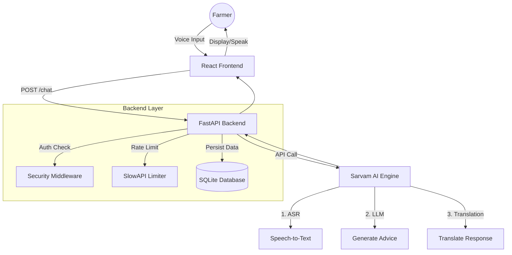

# AgroGPT: Multilingual Voice-First Agricultural Advisor
## Architecture, Analogies, and Interview Preparation Guide

---

## 1. Project Overview & The "Why"

**AgroGPT** is an AI-powered agricultural advisor designed to bridge the digital divide for farmers who may not be fluent in English or comfortable with typing.

*   **Problem**: Most agricultural knowledge is locked behind text interfaces in English. Rural farmers speak regional languages (Bengali, Hindi, etc.) and prefer speaking over typing.
*   **Solution**: A voice-enabled mobile web app where farmers can ask questions in their native language and receive spoken (or text) advice in that same language.

### 🌟 The "Restaurant Analogy" (To Explain the Whole System)

Imagine AgroGPT as a **high-end international restaurant**:

1.  **The Customer (User)**: The farmer who speaks only Bengali. They don't know the chef's language (English/Code).
2.  **The Waiter (Frontend)**: This is your **React App**.
    *   It takes the customer's order (Voice Input).
    *   It translates the customer's intent into a structured format the kitchen understands (API Request).
    *   It brings the food (Advice) back to the table in a way the customer can enjoy (Translated Text/Audio).
3.  **The Kitchen Manager (Backend)**: This is **FastAPI**.
    *   It checks if the waiter is authorized to enter (API Key Security).
    *   It ensures the waiter isn't overwhelming the chef with 100 orders a minute (Rate Limiting).
    *   It decides which chef needs to cook the meal (Routing).
4.  **The Master Chef (AI Model)**: This is **Sarvam AI**.
    *   It takes the raw ingredients (Transcribed Text).
    *   It cooks the meal (Generates Advice).
    *   It prepares it in the requested style (Translates back to Bengali).

---

## 2. System Architecture Breakdown

### 🏗️ High-Level Diagram

### 🧱 Component Details

#### 1. Frontend (The Interface)
*   **Tech**: React, Vite, Tailwind CSS.
*   **Role**: Captures audio using the browser's `MediaRecorder API`. It converts the farmer's voice into a `Blob` (a file-like object) and sends it to the backend.
*   **Analogy**: The waiter's notepad. It records exactly what the customer said and hands it off to the kitchen.

#### 2. Backend (The Brain)
*   **Tech**: FastAPI (Python), Uvicorn.
*   **Role**: Orchestrates the entire flow. It is **async** (asynchronous), meaning it can handle multiple farmers asking questions at the same time without making anyone wait.
*   **Analogy**: A highly efficient kitchen expeditor who shouts orders to station chefs while checking tickets.

#### 3. Database (The Memory)
*   **Tech**: SQLite (Development), SQLAlchemy (ORM).
*   **Role**: Stores conversation history (`chat_sessions`, `chat_messages`).
*   **Analogy**: The restaurant's logbook. "Oh, this customer was here yesterday and asked about rice blight. Let's remember that context."

#### 4. AI Engine (The Intelligence)
*   **Tech**: Sarvam AI (`saarika:v2.5` for voice, `sarvam-m` for chat).
*   **Role**: Performs Speech Recognition (ASR), Language Understanding (LLM), and Translation (NMT).
*   **Analogy**: The polyglot genius chef who understands every ingredient and every language.

---

## 3. Key Technical Decisions (Interview Gold)

### ❓ Why FastAPI instead of Flask/Django?
*   **Analogy**: Flask is like a single-lane road (Synchronous). If a big truck (slow AI request) is on it, everyone behind waits. FastAPI is a multi-lane superhighway (Asynchronous). While the AI is "thinking" (I/O bound), the server can still accept new requests from other users.
*   **Technical Answer**: "I chose FastAPI for its native async/await support, which is critical for I/O-heavy applications like this that rely on external AI APIs. It also provides automatic data validation with Pydantic and auto-generated Swagger documentation."

### ❓ How do you handle Security?
*   **Analogy**: The Bouncer and the Ticket Taker.
    *   **API Keys (The Ticket)**: Only users with a valid "ticket" (API Key) in their header are allowed in.
    *   **Rate Limiting (The Bouncer)**: Even with a ticket, you can't rush in 50 times a minute. We limit you to 10 requests/minute to prevent chaos (DoS attacks) and save money.
*   **Technical Answer**: "I implemented a custom middleware middleware that validates an `X-API-Key` header against environment variables. I also used `slowapi` to enforce a fixed-window rate limit (10 req/min) per IP address to prevent abuse and manage API costs."

### ❓ How does the Voice Feature work technically?
*   **Flow**:
    1.  Browser captures microphone stream (`navigator.mediaDevices.getUserMedia`).
    2.  `MediaRecorder` chunks audio into a `Blob` (WebM format).
    3.  Frontend sends this Blob as `multipart/form-data` to the backend.
    4.  Backend passes the file to Sarvam's ASR model (`saarika:v2.5`).
    5.  Sarvam returns text.

---

## 4. Top Interview Questions & Answers

### Q1: "What was the hardest bug you faced?"
*   **Situation**: "I was trying to send the recorded audio to the backend, but it kept failing with a 400 error."
*   **Task**: "I needed to ensure the binary audio data reached the server correctly."
*   **Action**: "I realized the browser was creating a `WebM` blob, but I wasn't setting the correct MIME type or filename in the `FormData`. I debugged this by inspecting the network request payload in DevTools."
*   **Result**: "I explicitly named the file `audio.webm` in the FormData append method, which allowed FastAPI's `UploadFile` to parse it correctly."

### Q2: "How would you scale this for 10,000 users?"
*   **Database**: Migrate from SQLite (single file) to **PostgreSQL** (client-server DB) for better concurrency.
*   **Backend**: Containerize the FastAPI app (which I've already done!) and deploy it on **Kubernetes** or **AWS ECS** to auto-scale the number of instances based on traffic.
*   **Caching**: Add **Redis** to cache common answers (e.g., "How to treat potato blight?") so we don't have to pay for the AI to generate the same answer 500 times.

### Q3: "Can this handle dialects like Sylheti or Chittagonian?"
*   **Honest Answer**: "Currently, the system is optimized for Standard Bengali (`bn-IN`) using Sarvam's `saarika` model. While it handles standard accents well, deep regional dialects might lower accuracy. To solve this in production, I would integrate a fine-tuned version of **OpenAI Whisper** trained on datasets like 'Ben-10' or 'BanglaTalk' which specifically target these dialects."

---

## 5. Visualizing the Data Flow

**The Journey of a "Hello"**

1.  🎤 **User speaks**: "Hello"
2.  📦 **Frontend**: Wraps "Hello" sound into a digital package (`Blob`).
3.  🚀 **Network**: Flies to the Backend.
4.  🛡️ **Gatekeeper**: "Do you have a key? Yes. Are you spamming? No. Enter."
5.  🧠 **AI Processor**: Unwraps package -> Hears "Hello" -> Thinks "Greetings" -> Translates to Bengali "Nomoshkar".
6.  💾 **Scribe**: "User said Hello, AI said Nomoshkar" (Writes to DB).
7.  👀 **Frontend**: Shows "Nomoshkar" on screen.

---

*Verified by Architecture Team*
*Generated for AgroGPT Documentation*
